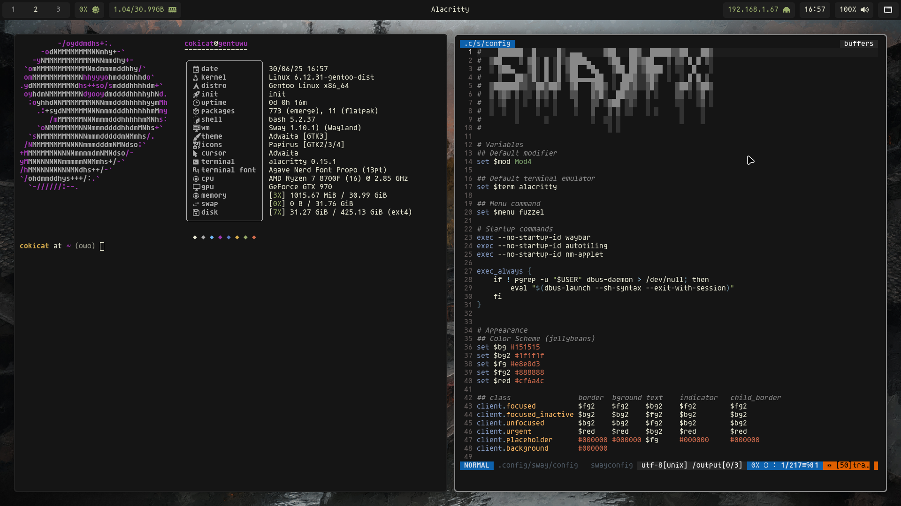
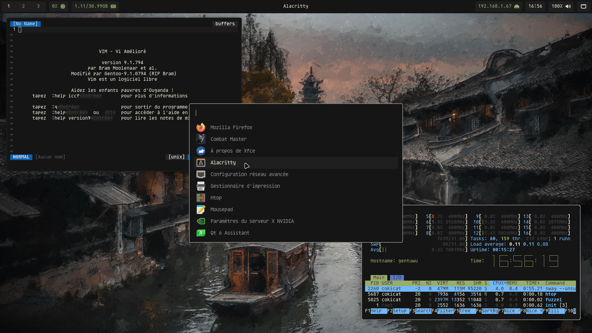
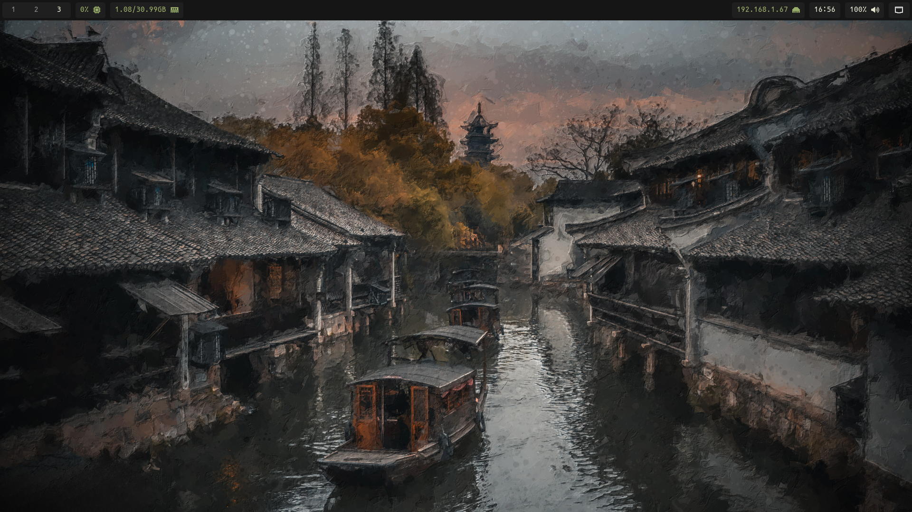
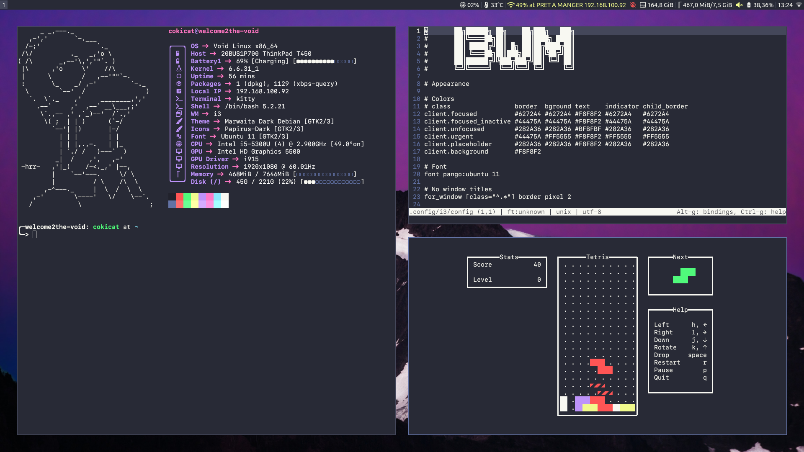
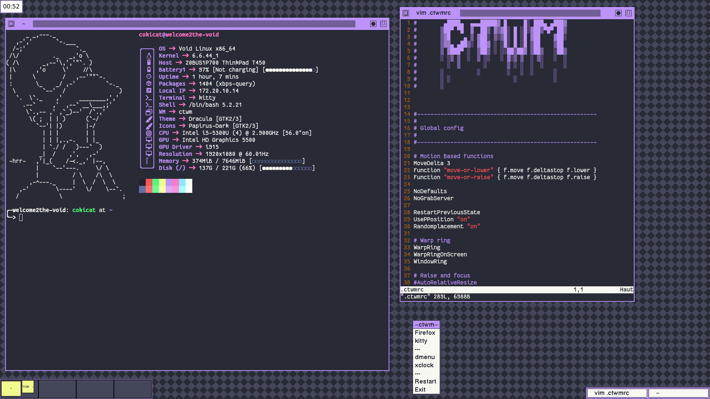

<h1 align="center">cokicat's dotfiles</h1>

## ✨ Showcase

<video src="screenshots/gruvbox_swayfx.mp4" controls></video>

## 🌈 Rices

  
jellybeans rice (SwayFX, alacritty, waybar, fuzzel)

  
  
  

  ## [🖼️ Background](https://wallhaven.cc/w/rq75r7)

  
gruvbox rice (SwayFX, alacritty, waybar, fuzzel, swaylock-color)

  <video src="screenshots/gruvbox_swayfx.mp4" controls></video>

  
Dracula rice (i3wm, CTWM, kitty)

  
  

  ## License
  This repository includes parts of [Dracula Theme](https://github.com/dracula/dracula-theme.git) by [Dracula Team](https://github.com/dracula) which is distributed under MIT License. See `dracula_rice/LICENSE` for the full terms of the license.

  
JWM rice

  

  ## License
  `.jwmrc` file is based on [phono-theme](https://github.com/cbettinger/phono-theme) by [cbettinger](https://github.com/cbettinger/) which is distributed under the ISC License. See `jwm_rice/LICENSE_jwmrc` for the full terms of the license.

  ## [🖼️ Background](https://wallup.net/wp-content/uploads/2016/05/27/482-Aperture_Laboratories-Portal.jpg)

[suckless rice (dwm, st, dmenu)](https://github.com/cokicat/dotfiles-suckless)
