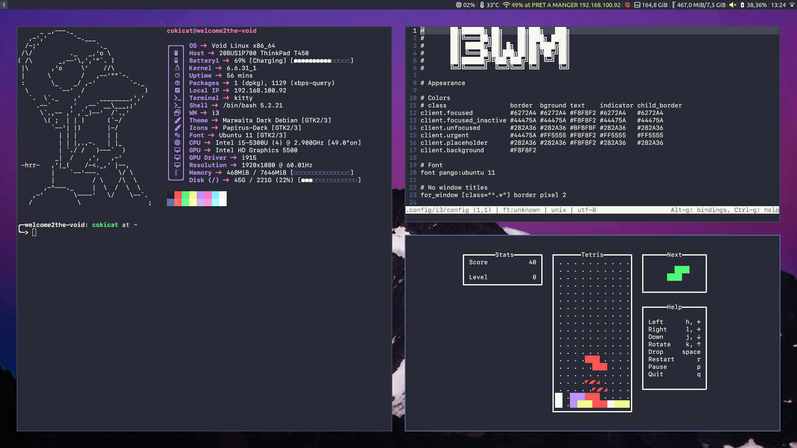
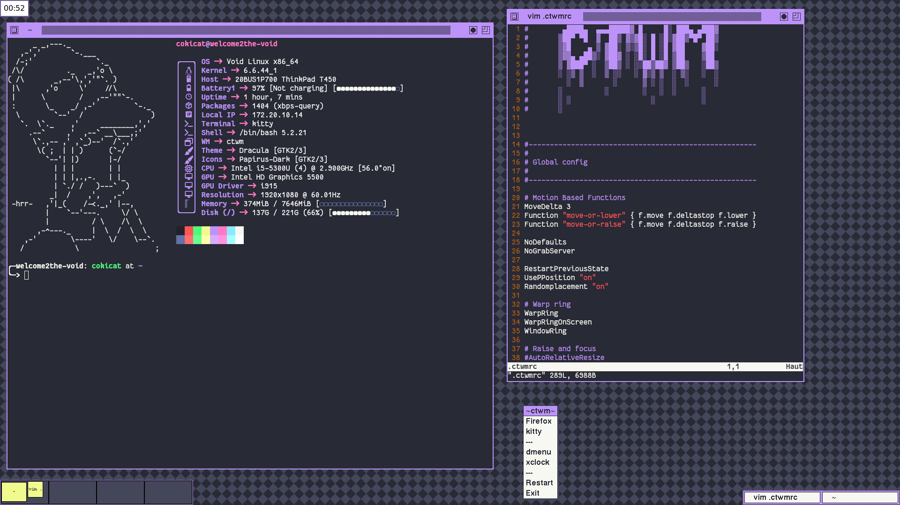

<h1 align="center">cokicat's dotfiles — Dracula</h1>

<b>Colorscheme: <a href="https://draculatheme.com">Dracula</a></b>

## ✨ Showcase

## 🌈 Rices
- [Main rice](https://github.com/cokicat/dotfiles)
- [jellybeans rice (SwayFX, alacritty, waybar, fuzzel)](https://github.com/cokicat/dotfiles/tree/jellybeans)
- Dracula rice (i3wm, CTWM, kitty) [here]
- [JWM rice](https://github.com/cokicat/dotfiles/tree/jwm)
- [uckless rice (dwm, st, dmenu)](https://github.com/cokicat/dotfiles-suckless)

## [🖼️ Background](https://raw.githubusercontent.com/dracula/wallpaper/master/first-collection/void.png)

## License
This branch includes parts of [Dracula Theme](https://github.com/dracula/dracula-theme.git) by [Dracula Team](https://github.com/dracula) which is distributed under MIT License. See LICENSE for the full terms of the license.
