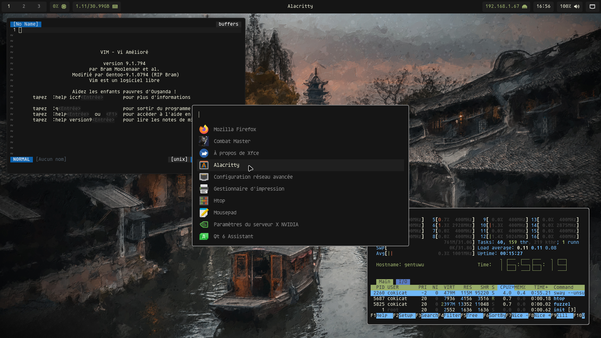
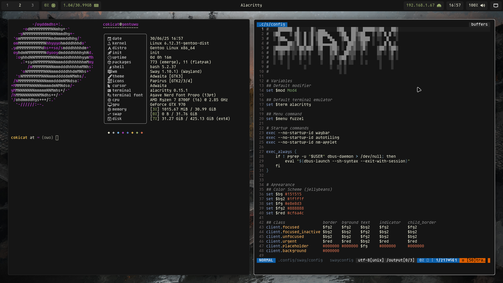
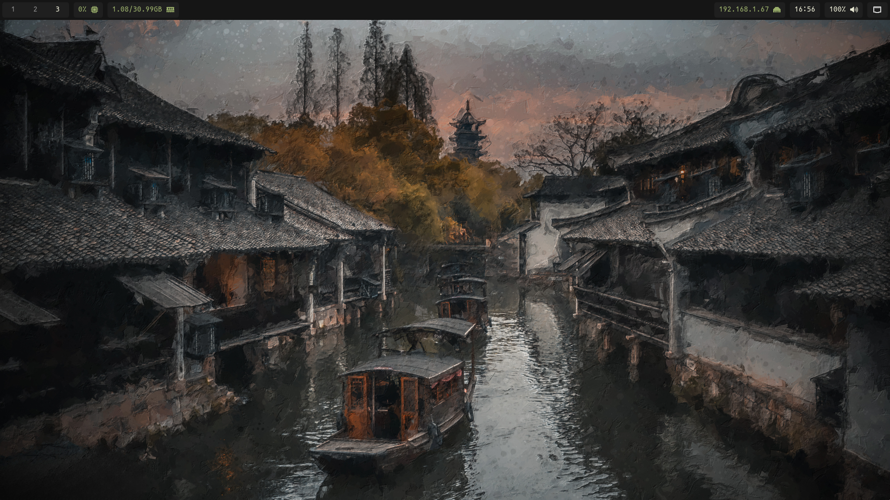

<h1 align="center">cokicat's dotfiles</h1>

<b>Colorscheme: <a href="https://github.com/nanotech/jellybeans.vim">jellybeans</a></b>

## ✨ Showcase

## 🌈 Rices
- [Main rice](https://github.com/cokicat/dotfiles)
- jellybeans rice (SwayFX, alacritty, waybar, fuzzel) [here]
- [Dracula rice (i3wm, CTWM, kitty)](https://github.com/cokicat/dotfiles/tree/dracula)
- [JWM rice](https://github.com/cokicat/dotfiles/tree/jwm)
- [suckless rice (dwm, st, dmenu)](https://github.com/cokicat/dotfiles-suckless)

## [🖼️ Background](https://wallhaven.cc/w/rq75r7)
