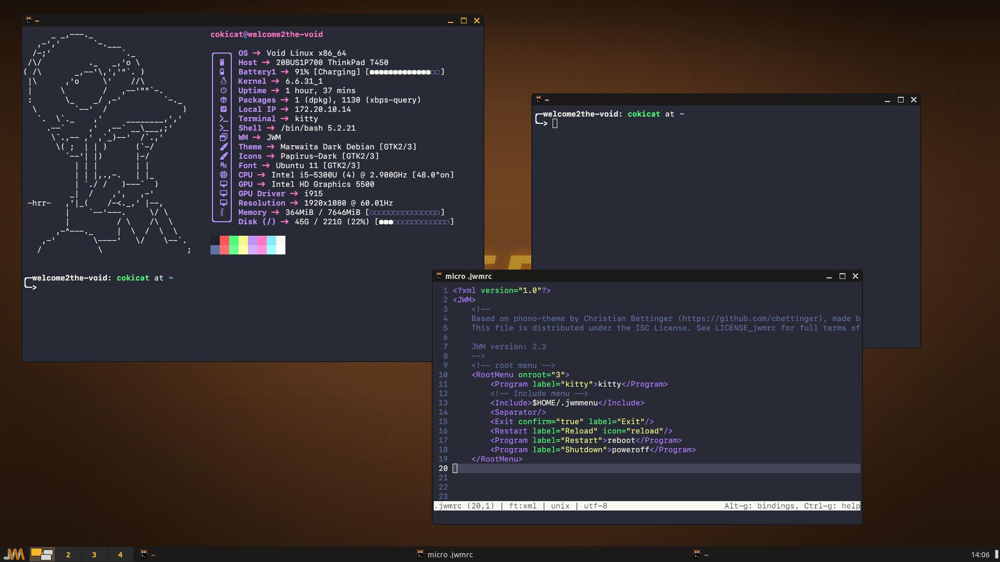

# JWM

Configuration for menu and startup commands are located in `.jwmmenu` and `.jwmstartup`.

## [Aperture Background](https://wallup.net/wp-content/uploads/2016/05/27/482-Aperture_Laboratories-Portal.jpg)

## License
`.jwmrc` file is based on [phono-theme](https://github.com/cbettinger/phono-theme) by [cbettinger](https://github.com/cbettinger/) which is distributed under the ISC License. See LICENSE_jwmrc for the full terms of the license.
