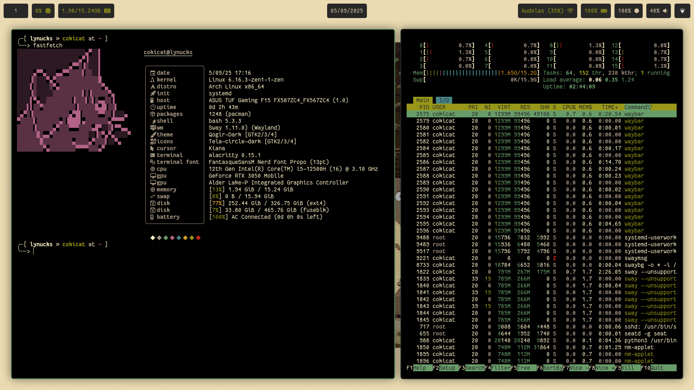

<h1 align="center">cokicat's dotfiles</h1>

## ✨ Showcase

## 🌈 Rices

  
Tango rice (LabWC, alacritty, yambar, bemenu)

  

  ## [🖼️ Background](https://wallhaven.cc/w/5g9l25)
  ## [👤 r/unixporn Post](https://www.reddit.com/r/unixporn/comments/1qig0ay/labwc_minimalist_rice_because_minimalist_pc/)

  
jellybeans rice (SwayFX, alacritty, waybar, fuzzel)

  
  
  

  ## [🖼️ Background](https://wallhaven.cc/w/rq75r7)
  ## [👤 r/unixporn Post](https://www.reddit.com/r/unixporn/comments/1lqau7c/swayfx_jellybeans_rice/)

  
gruvbox rice (SwayFX, alacritty, waybar, fuzzel, swaylock-color)

  

  ## [👤 r/unixporn Post](https://www.reddit.com/r/unixporn/comments/1n98arh/swayfx_my_old_gruvbox_rice/)

  
Dracula rice (i3wm, CTWM, kitty)

  
  

  ## 👤 r/unixporn Posts
  - [i3wm](https://www.reddit.com/r/unixporn/comments/1dey5s1/i3_my_first_rice/)
  - [CTWM](https://www.reddit.com/r/unixporn/comments/1es7828/ctwm_minimalist/)

  ## 📄 License
  This repository includes parts of [Dracula Theme](https://github.com/dracula/dracula-theme.git) by [Dracula Team](https://github.com/dracula) which is distributed under MIT License. See `dracula_rice/LICENSE` for the full terms of the license.

  
JWM rice

  

  ## 📄 License
  `.jwmrc` file is based on [phono-theme](https://github.com/cbettinger/phono-theme) by [cbettinger](https://github.com/cbettinger/) which is distributed under the ISC License. See `jwm_rice/LICENSE_jwmrc` for the full terms of the license.

  ## [🖼️ Background](https://wallup.net/wp-content/uploads/2016/05/27/482-Aperture_Laboratories-Portal.jpg)

[suckless rice (dwm, st, dmenu)](https://github.com/cokicat/dotfiles-suckless)
