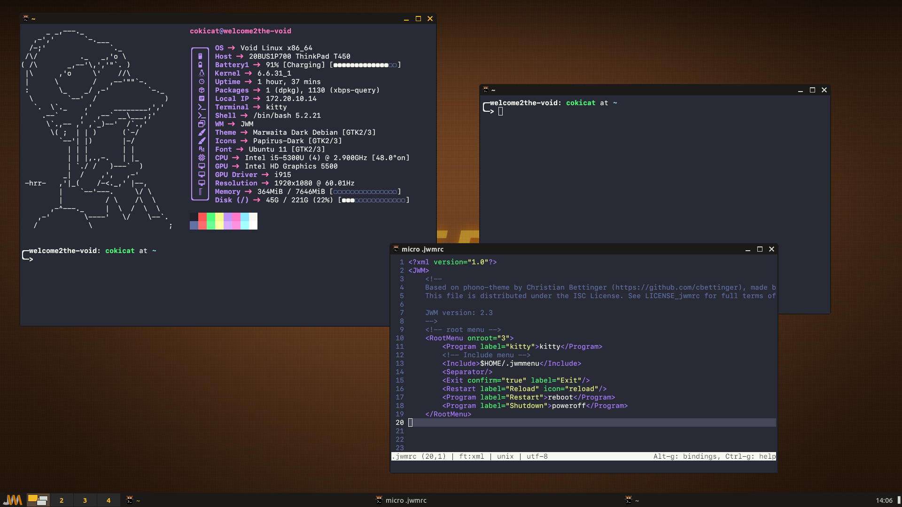

# cokicat's dotfiles

Here are my dotfiles for a simple and lightweight desktop.

- Window Managers: i3, CTWM, JWM
- GTK Themes: [Marwaita Dark Debian](https://github.com/darkomarko42/Marwaita-Debian), [Dracula](https://draculatheme.com/gtk)
- Icon Theme: [Papirus](https://www.pling.com/p/1166289) (`papirus-icon-theme`)
- Mouse Theme: [Bibata Modern Ice](https://www.pling.com/p/1197198)
- Shell: bash
- Terminal: kitty
- Editor: nano, vim
- Launcher: dmenu
- Tools: neofetch

## License
This repository include parts of [Dracula Theme](https://github.com/dracula/dracula-theme.git) by [Dracula Team](https://github.com/dracula) which is distributed under MIT License. See LICENSE for the full terms of the license.  
`.jwmrc` file is based on [phono-theme](https://github.com/cbettinger/phono-theme) by [cbettinger](https://github.com/cbettinger/) which is distributed under the ISC License. See LICENSE_jwmrc for the full terms of the license.

## Backgrounds
- [Aperture](https://wallup.net/wp-content/uploads/2016/05/27/482-Aperture_Laboratories-Portal.jpg)
- [Linux](https://images.hdqwalls.com/download/tux-penguin-4k-3z-2560x1440.jpg)
- [Dracula](https://raw.githubusercontent.com/dracula/wallpaper/master/first-collection/void.png)

## JWM
Add your own shortcuts in `.jwmmenu` and your startup commands in `.jwmstartup`

## Dependencies
### Fonts
- [Ubuntu Nerd](https://github.com/ryanoasis/nerd-fonts/tree/master/patched-fonts/Ubuntu)
- [Ubuntu Mono Nerd](https://github.com/ryanoasis/nerd-fonts/tree/master/patched-fonts/UbuntuMono)
- [SF Mono](https://developer.apple.com/fonts/)

### Other
- `feh`
- `xrandr`
- `pactl`
- `xss-lock`

## To do
- [x] Clear `.bashrc` file
- [ ] Add Sway, foot, micro and Fluxbox config
- [ ] Clear `.nanorc` file
